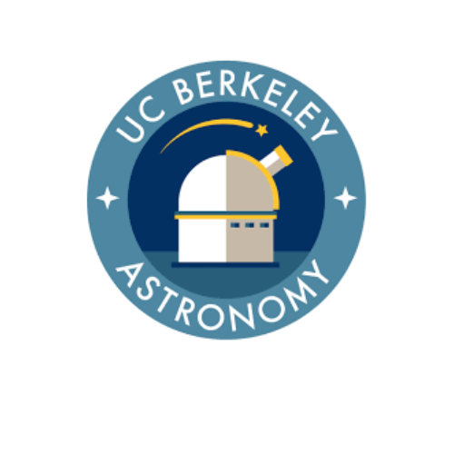

# 🌌 BAD Grads
**Berkeley Astronomy Department Graduate Students**

Welcome to the GitHub home of the **UC Berkeley Astronomy Department graduate student community** — affectionately known as **BAD Grads**.

This repository serves as a shared space for:

- 🧭 Institutional knowledge
- 📚 Internal documentation
- 🛠️ Shared tools & resources
- 🧑‍🚀 Grad-student–run projects
- 🗂️ Things we wish someone had told us earlier

Whether you’re brand new, deep into your PhD, or about to defend, the repos in this organization are here to make life a little easier.

---

## 📖 What lives here?

Typical contents may include:

- **Onboarding & survival guides**
- **Department norms, timelines, and expectations**
- **TA / GSI resources**
- **Observing & computing tips**
- **Conference, fellowship, and funding info**
- **Social + community initiatives**
- **Living documents maintained by grads, for grads**

Nothing here is official department policy — this is a *peer-maintained* resource.
