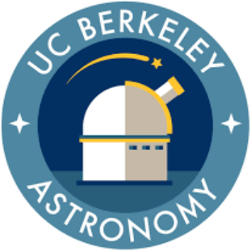

  

<h1 align="center" style="margin-top: 0;">
  🌌 BAD Grads
</h1>

  <strong>Berkeley Astronomy Department Graduate Students</strong>

Welcome to the GitHub home of the **UC Berkeley Astronomy Department graduate student community** — affectionately known as **BAD Grads**.

This repository serves as a shared space for:

- 🧭 Institutional knowledge
- 📚 Internal documentation
- 🛠️ Shared tools & resources
- 🧑‍🚀 Grad-student–run projects
- 🗂️ Things we wish someone had told us earlier

Whether you’re brand new, deep into your PhD, or about to defend, the repos in this organization are here to make life a little easier.

## 📖 What lives here?

Typical contents may include:

- **Onboarding & survival guides**
- **Department norms, timelines, and expectations**
- **TA / GSI resources**
- **Observing & computing tips**
- **Conference, fellowship, and funding info**
- **Social + community initiatives**
- **Living documents maintained by grads, for grads**

Nothing here is official department policy — this is a *peer-maintained* resource.

---

## 🤝 Contributing to BAD Grads

The **BAD Grads GitHub organization** is more than just a wiki — it’s a shared home for
graduate-student–maintained resources, tools, and documentation.

Contributions are encouraged, but we follow a few light guidelines to keep things
organized and sustainable over time.

### 👥 Who can contribute?

Any **current or former UC Berkeley Astronomy graduate student**

### 📦 What can I contribute?

Contributions typically take one of two forms:

#### 📝 The Wiki
Use the wiki for:

- Text-based guides
- Living documents
- Onboarding and institutional knowledge
- Resources that benefit most students

If it’s primarily **documentation**, it probably belongs in the wiki. The rules for contributing to the wiki can
be found in the corresponding repository and are somewhat different than those for individual repositories.

#### 🗃️ GitHub Repositories
Create a new repository for:

- Code or software tools
- Data-processing workflows
- Larger projects that evolve over time
- Anything that benefits from versioning, issues, or releases

If it’s **code-heavy**, reusable, or growing, it likely deserves its own repo.

#### ❓ Wiki or new repo?

Ask yourself:
- Is this mostly text? → **Wiki**
- Is this code, scripts, or a long-term project? → **Repo**

If you’re unsure, that’s totally fine — ask an admin.

### 🔐 Repository creation & access
- New repositories are created by **BAD Grads admins**
- This helps maintain continuity as students graduate
- To request a repo:
  - Open an issue, or
  - Email the current BAD Grads admin(s)

Admins can also help decide whether your contribution fits best as a wiki page or a new repository.

### 🌱 Guiding principles
We aim to keep this space:
- Useful over time
- Easy to navigate
- Low-barrier to contribute
- Maintained *by grads, for grads*

Perfection is not required — clarity and kindness are.

If you have ideas, questions, or improvements, start a conversation.  
This organization grows with each cohort.

---

# Repositories

For easy access, the following is a list of repositories. Many of these are private and will be locked to 
non-organization users.

**The Wiki Repository** (Public): https://github.com/BadGrads/BadGradWiki

**Courses** (Private):

- [ASTRON 7A](https://github.com/BadGrads/ASTRON_7A)
- [ASTRON 7B](https://github.com/BadGrads/ASTRON_7B)
- [ASTRON C10](https://github.com/BadGrads/ASTRON_C10)

**Graduate Resources** (Private):

- [Qualifying Exam]() (In Progress)
- [Preliminary Exam]() (In Progress)
- [Thesis]() (In Progress)

